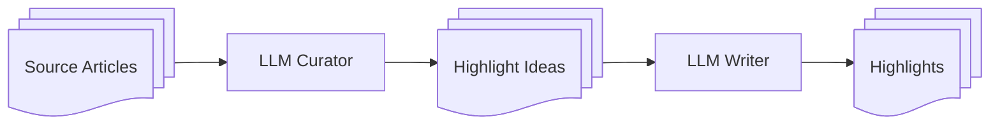

# Newsaic

> A personalized news application. Built with React, Django Rest Framework, and MongoDB.

## Features

### Daily Highlights

A curated set of the most relevant news stories for the reader.

Using a two-step LLM chain, source articles are first selected based on relevance and grouped into related story ideas. Each story idea is then written according to the user’s preferences for style, tone, and length.

In addition, narrations are automatically generated using [Kokoro-82M](https://huggingface.co/hexgrad/Kokoro-82M).

### News Feed

A personalized feed of articles based on the reader’s selected topics.

On an article page, readers can:
- View suggested articles related to the content.
- Ask questions about the article, powered by RAG.
